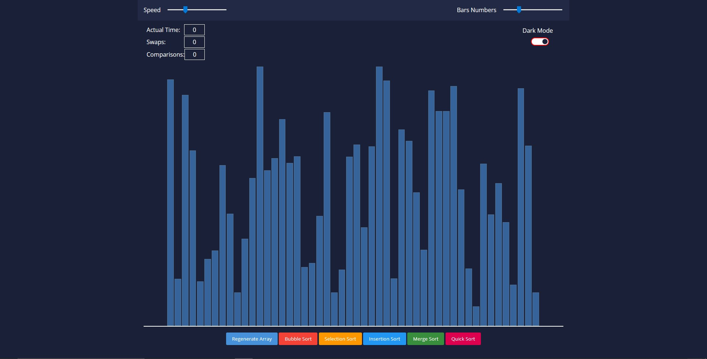
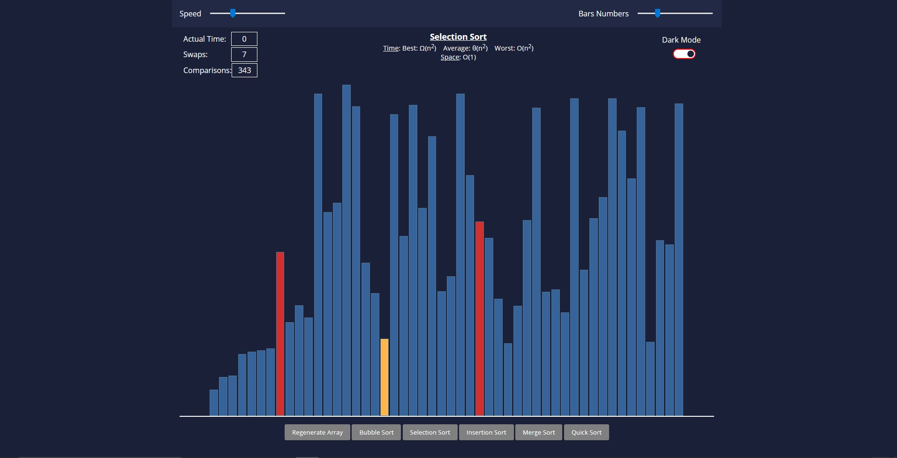

# **Sorting Visulaizer 📅 👈**

 

 

This is the [Sorting Visualizing App](https://sortingalgovisualizer.netlify.app) built using Reactjs.

An App to make `Sorting Algos` understand easier.
 

## **Visualization Section ⚙️**

This is the main and only page of the Web App. Here, You can see :-

- Different `Sorting Algo` buttons
- `Regenerating Array` Button
- Two sliders on the top bar, one for `Controlling Speed` & other for `Managing bar numbers`
- `Dark Mode Toggler`
    

## **Visualization Section ✏️📈**

This is the main page of the Web App during visualization: Here you can see:-

- Stats box at top left mentioning `Actual Time` for sorting, `Name and Desc about complexity` of current sort.
- `Dark Mode Toggler`
- Can `manage` the speed of sort using `Speed Slider` but the second `numbers slider` is `inactive`.
- The other buttons are also inactive during sorting.
    
